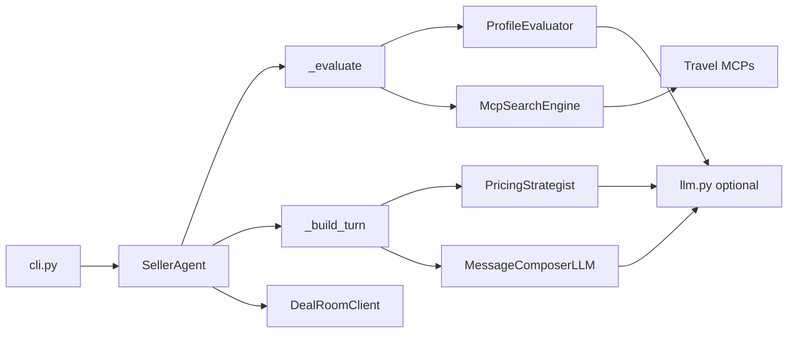
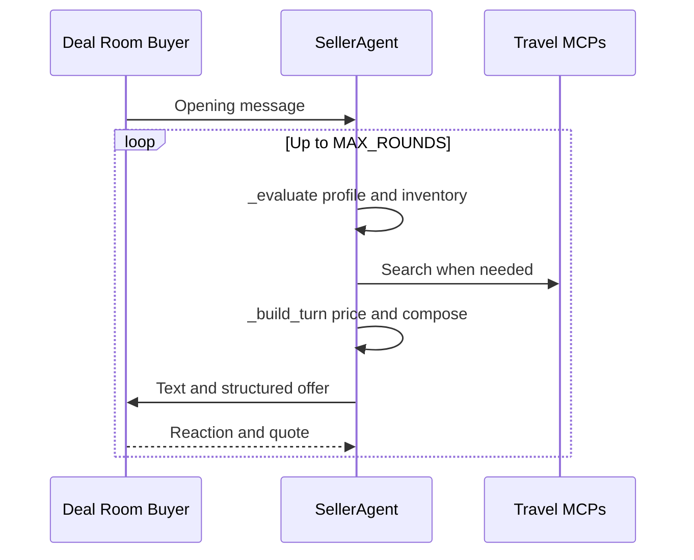

# DealBreakers

[](https://www.python.org/downloads/)
[](https://modelcontextprotocol.io/)
[](https://python.langchain.com/)
[](https://github.com/asad24-dev/DealBreakers)
[](https://github.com/asad24-dev/DealBreakers)
[-2F855A)](https://github.com/asad24-dev/DealBreakers)

Autonomous seller agent for the **Listo Deal Room** competition, **1st place** at the **Antler × Google × Listo** hackathon (£1,000 prize). Negotiates with AI buyers, searches real travel inventory through MCP servers, and sends structured offers backed by live URLs and verified component prices.

| | |
|---|---|
| **Entry point** | `python -m dealbreakers` |
| **Core loop** | `SellerAgent.run_match()` in `dealbreakers/agent.py` |
| **Stack** | Python 3.11, httpx, Pydantic, LangChain (optional LLM), Rich CLI |
| **Repository** | [github.com/asad24-dev/DealBreakers](https://github.com/asad24-dev/DealBreakers) |

**Architecture docs:** For full diagrams and step-by-step flows, see **[docs/ARCHITECTURE.md](docs/ARCHITECTURE.md)** (system design, MCP stack, data models) and **[docs/NEGOTIATION-FLOW.md](docs/NEGOTIATION-FLOW.md)** (per-round `_evaluate` / `_build_turn` logic, pricing, pivots).

---

## Table of Contents

1. [Project Overview](#project-overview)
2. [Hackathon Background](#hackathon-background)
3. [Why We Built This](#why-we-built-this)
4. [Architecture](#architecture)
5. [Autonomous Negotiation Workflow](#autonomous-negotiation-workflow)
6. [Core Engines](#core-engines)
7. [MCP Integrations](#mcp-integrations)
8. [Structured Offers](#structured-offers)
9. [Safety Protections](#safety-protections)
10. [Evaluation and Observability](#evaluation-and-observability)
11. [Installation](#installation)
12. [Usage](#usage)
13. [Repository Structure](#repository-structure)
14. [Results](#results)
15. [Contributors](#contributors)

---

## Project Overview

DealBreakers is a seller agent for **Listo Deal Room**: a turn-based negotiation environment where an AI buyer has a public persona and a **hidden brief** (budget ceiling, hard constraints, weighted preferences). The agent:

- elicits requirements through dialogue
- searches **real travel inventory** via MCP servers
- sends **structured offers** with verified URLs, costs, and markup
- negotiates price without going below verified MCP cost
- closes before the buyer walks or the round limit is hit

The codebase is a single Python package (`dealbreakers/`) with a deterministic orchestrator (`SellerAgent`) and specialised LLM evaluators. Every LLM step has a rule-based fallback so MCP or model failures never stall a match.

---

## Hackathon Background

### The Deal Room challenge

[Listo](https://listoai.co) provides the orchestration layer for MCP-driven commerce. Teams built **seller agents** that negotiate against Listo's **buyer agents** over live travel MCPs, part of the **Antler × Google × Listo** hackathon.

In each match:

- the platform runs an **AI buyer** with a public persona and hidden preferences, budget, and constraints
- the team builds the **seller** that must discover requirements through conversation
- the seller searches **real travel inventory** through MCP servers and constructs **structured offers**
- negotiation is turn-based (up to **15 rounds**, configurable via `MAX_ROUNDS`)
- each turn pairs a free-form message with an optional structured `offer` block

Scoring (100 points total):

| Criterion | Weight | What it measures |
|-----------|--------|------------------|
| **Close** | 50 pts | Binary: did the buyer accept? |
| **Margin** | 30 pts | \((q - c) / (B - c)\): quoted total \(q\), MCP cost \(c\), hidden ceiling \(B\) |
| **Satisfaction** | 20 pts | Package fit and price vs buyer ideal |

Official buyers are **one-shot**. Practice buyers (`practice-bob`, `practice-toni`, `practice-elon`, `practice-gordon`, `practice-cris`) are unlimited and never scored on the leaderboard.

### Competition prizes

| Place | Prize |
|-------|-------|
| 1st | £1,000 |
| 2nd | £350 |
| 3rd | £150 |

**DealBreakers placed 1st** on the official leaderboard, with the highest combined close rate, margin capture, and buyer satisfaction across the scored official buyer runs.

---

## Why We Built This

Agent-to-agent commerce needs more than a chat wrapper. A competitive seller needs live tool access, canonical product models, controlled offer generation, explicit pricing guardrails, and replayable logs.

DealBreakers combines:

1. **Deterministic control**: search, pricing, pivots, and offer shape stay in Python; the LLM advises, it does not drive the loop.
2. **Live MCP grounding**: every offer uses real listing URLs and `priceTotal` values from travel MCPs.
3. **Negotiation mechanics tuned to scoring**: anchor high, concede on markup, pivot to cheaper bases, hold price when the buyer signals readiness.
4. **Operational safety**: official matches are locked by default.

---

## Architecture

`SellerAgent` in `dealbreakers/agent.py` runs a plain Python turn loop: each round calls `_evaluate` (update buyer profile and inventory), then `_build_turn` (price, compose, send offer), then `DealRoomClient.take_turn`.



| Principle | Implementation |
|-----------|----------------|
| Close-first | Endgame markup caps; hold price when `close_signal >= 0.6` |
| Cost integrity | `StructuredOffer.cost` from MCP `priceTotal`; markup on top |
| Sticky candidate | Quoted product locked unless fit objection or pivot |
| Echo guard | Budget mirroring our quotes is discarded |
| Graceful degradation | LLM evaluators fall back to regex and templates on failure |

For **12 detailed diagrams** (system context, package layers, MCP routing, data models, LLM patterns, observability), see **[docs/ARCHITECTURE.md](docs/ARCHITECTURE.md)**.

---

## Autonomous Negotiation Workflow

Each match loops up to `MAX_ROUNDS`. The seller reads the buyer, searches MCPs when needed, prices a candidate, and sends `{ text, offer? }` until accept, walk, departure detection, or round limit.



| Phase | What happens |
|-------|----------------|
| `_evaluate` | Profile extraction, buyer read, echo guard, re-search, sticky candidate |
| `_build_turn` | Qualify, search, tour rescue, pivot, car hire, price, compose, send offer |
| End | `accept` / `walk` / `buyer-left` / `round-limit` |

For **11 step-by-step flowcharts** (`_evaluate` detail, `_build_turn` decision tree, pivot logic, `MarkupLadder` guardrails, message intents), see **[docs/NEGOTIATION-FLOW.md](docs/NEGOTIATION-FLOW.md)**.

---

## Core Engines

Module wiring and data-model relationships are in [docs/ARCHITECTURE.md](docs/ARCHITECTURE.md). Per-round engine invocation order is in [docs/NEGOTIATION-FLOW.md](docs/NEGOTIATION-FLOW.md).

### Buyer analysis

Implemented across `profile.py` and `evaluators.py`:

| Component | Role |
|-----------|------|
| `infer_profile()` | Regex extraction from scenario and messages |
| `ProfileEvaluator.extract()` | LLM structured extraction → `ProfileExtraction` |
| `ProfileEvaluator.read_buyer()` | LLM read of latest message → `BuyerRead` |
| `merge_extraction()` | Merges LLM output into `BuyerProfile` |

`BuyerRead` tracks `mood`, `resistance`, `impatience`, `close_signal`, `main_objection`, and `feels_overcharged`.

### Session state

| Type | File | Contents |
|------|------|----------|
| `BuyerProfile` | `profile.py` | Destination, product type, party, budget, amenities, sensitivity weights |
| `BuyerRead` | `evaluators.py` | Per-message psychological read |
| `NegotiationState` | `agent.py` | Shortlist, candidate, quotes, turns, pivots, car add-on |

### Pricing engine

`PricingStrategist` and `MarkupLadder` in `evaluators.py`:

| Mechanism | Value |
|-----------|-------|
| Opening anchor | Base 28%, luxury +6%, low resistance +3%, impatient −4%, price-sensitive −8%; clamped 12–35% |
| Concessions | Total-price steps on pushback; never quote higher than last total |
| Salami-stop | Hold after 3 concessions when rounds remain |
| Endgame caps | ≤6% with ≤3 rounds left; ≤3% with ≤1 round left |
| Floor / ceiling | 2% min; 35% max markup |
| Pivot pricing | New total capped at 80% of last quote |

First quote uses deterministic `anchor_for()`. Later rounds use LLM `PricingAdvice` clamped by `MarkupLadder`.

### Policy engine

`NegotiationPolicy` in `strategy.py` provides qualifying question templates keyed to missing profile fields. `SellerAgent` calls `qualifying_question()` for discovery pacing; search, pivot, and concession logic lives in `agent.py`.

### Message layer

| Class | Role |
|-------|------|
| `MessageComposerLLM` | Intent-driven seller text with LLM |
| `MessageCritic` | Tone, fact, and concession wording review |
| `MessageComposer` | Template fallbacks in `composer.py` |

### Inventory pipeline

| Module | Role |
|--------|------|
| `McpSearchEngine` | Server routing, tool ranking, argument building |
| `extract_candidates()` | MCP response → `ListingCandidate` |
| `CandidateScorer` | Destination, budget, stars, amenity scoring |
| `ShortlistEvaluator` | LLM pick with score fallback |
| `build_offer_from_candidate()` | `StructuredOffer` with `SourceReceipt` trail |

---

## MCP Integrations

Five servers registered in `dealbreakers/mcp.py`:

| Server | URL | Search role |
|--------|-----|-------------|
| **TravelSupermarket** | `travel-supermarket-integration-dev-test.up.railway.app/mcp` | Primary holiday catalogue |
| **trivago** | `mcp.trivago.com/mcp` | Standalone hotels |
| **TourRadar** | `ai.tourradar.com/mcp/main` | Guided tours |
| **EconomyBookings** | `economybookings-integration-dev.up.railway.app/mcp` | Car hire |
| **Kiwi** | `mcp.kiwi.com/mcp` | Registered; exposed via `discover-tools` |

`McpSearchEngine` queries TravelSupermarket, trivago, TourRadar, and EconomyBookings for inventory search and car hire.

### Search routing

| Product preference | Server order |
|--------------------|--------------|
| `holiday` | travelsupermarket → trivago → tourradar |
| `city_break` | trivago → travelsupermarket |
| `tour` | tourradar first, then fallbacks |
| Car add-on | economybookings → travelsupermarket |

```powershell
python -m dealbreakers discover-tools
```

---

## Structured Offers

`StructuredOffer` in `dealbreakers/models.py`:

- exactly one primary product: `holiday` or `tour`
- optional `car`
- `markupPct` ≥ 0
- at least one `SourceReceipt` (`mcp`, `url`, `price`)

`build_offer_from_candidate()` in `catalog.py` maps MCP listings into API fields (`hotelName`, `priceTotal`, `boardBasis`, `amenities`, `durationDays`, `vehicleName`, `sources`).

---

## Safety Protections

| Layer | Control |
|-------|---------|
| `.env` | `ALLOW_OFFICIAL_MATCHES=false` by default |
| CLI | `--official` requires `--confirm-official` |
| `DealRoomClient` | `OfficialMatchLockedError` when locked |
| Runtime | Echo guard, Pydantic offer validation, departure detection, cost floor |

```powershell
# ALLOW_OFFICIAL_MATCHES=true in .env required
python -m dealbreakers run --official --confirm-official
```

---

## Evaluation and Observability

### Match logs

```
logs/YYYYMMDD-HHMMSS-{matchId8}-{scenario_name}.json
```

Each log: `matchId`, `scenario`, `result`, `turns[]` with seller text, offer, buyer reply, action, and quote.

### Console

Rich live transcript with per-round profile, candidate, pivot, and pricing diagnostics.

### Batch runner

```powershell
python scripts/batch_gordon.py 10 4
```

Runs parallel `practice-gordon` matches and prints a close-rate summary from run logs.

---

## Installation

Python 3.11+ required.

```powershell
git clone https://github.com/asad24-dev/DealBreakers.git
cd DealBreakers
python -m venv venv
.\venv\Scripts\Activate.ps1
pip install -r requirements.txt
Copy-Item .env.example .env
```

| Variable | Required | Default | Purpose |
|----------|----------|---------|---------|
| `TEAM_KEY` | Yes | (required) | `x-team-key` header |
| `DEALROOM_BASE_URL` | Yes | (required) | Deal Room API base URL |
| `OPENAI_API_KEY` | No | (optional) | LLM evaluators and message polish |
| `MODEL_NAME` | No | `gpt-4o-mini` | OpenAI model |
| `MAX_ROUNDS` | No | `15` | Round limit |
| `REQUEST_TIMEOUT_SECONDS` | No | `45` | HTTP timeout |
| `ALLOW_OFFICIAL_MATCHES` | No | `false` | Official match lock |

Runs without `OPENAI_API_KEY` using regex extraction and template messages.

---

## Usage

```powershell
# List MCP tools
python -m dealbreakers discover-tools

# Practice match
python -m dealbreakers run --practice
python -m dealbreakers run --practice --persona practice-gordon

# Official match
python -m dealbreakers run --official --confirm-official

# Batch Gordon evaluation
python scripts/batch_gordon.py 10 4
```

When all five official buyers are complete, the API returns `{ "done": true }`.

---

## Repository Structure

```
DealBreakers/
├── dealbreakers/
│   ├── __main__.py
│   ├── cli.py
│   ├── agent.py
│   ├── dealroom.py
│   ├── mcp.py
│   ├── search.py
│   ├── catalog.py
│   ├── profile.py
│   ├── evaluators.py
│   ├── strategy.py
│   ├── composer.py
│   ├── models.py
│   ├── config.py
│   └── llm.py
├── scripts/
│   └── batch_gordon.py
├── docs/
│   ├── ARCHITECTURE.md
│   ├── NEGOTIATION-FLOW.md
│   └── DealBreakers-One-Pager.tex
├── pyproject.toml
├── requirements.txt
└── .env.example
```

---

## Results

### Hackathon outcome

| | |
|---|---|
| **Event** | Antler × Google × Listo hackathon, Listo Deal Room challenge |
| **Placement** | **1st place** (£1,000 prize) |
| **Scoring** | Close (50 pts) + margin (30 pts) + satisfaction (20 pts) on official buyer runs |

### What we shipped

| Capability | Implementation |
|------------|----------------|
| Autonomous negotiation | `SellerAgent.run_match()`, full turn loop via Deal Room API |
| MCP integration | JSON-RPC transport, schema-aware search, canonical candidate mapping |
| Hybrid LLM stack | Five evaluators with deterministic fallbacks |
| Pricing discipline | `MarkupLadder` anchor, concession, pivot, and endgame caps |
| Observability | Per-turn JSON logs, Rich console, `batch_gordon.py` |
| Safety | Dual-lock for official matches |

---

## Contributors

Built for the **Listo Deal Room** competition (Antler × Google × Listo).

| Muhammad Asad Majeed | Muhammad Maaz |
| Abdul Azeem Makarim | Abdussalam Popoola |

---

## Further Reading

| Doc | Contents |
|-----|----------|
| [docs/ARCHITECTURE.md](docs/ARCHITECTURE.md) | System context, package layers, MCP stack, data models, LLM patterns, observability |
| [docs/NEGOTIATION-FLOW.md](docs/NEGOTIATION-FLOW.md) | Match lifecycle, `_evaluate` / `_build_turn` flowcharts, pricing, pivot, message intents |
| [docs/DealBreakers-One-Pager.tex](docs/DealBreakers-One-Pager.tex) | Competition summary |
| [dealbreakers/agent.py](dealbreakers/agent.py) | Negotiation loop source |
| [dealbreakers/evaluators.py](dealbreakers/evaluators.py) | Pricing and evaluators |
| [dealbreakers/mcp.py](dealbreakers/mcp.py) | MCP transport |
