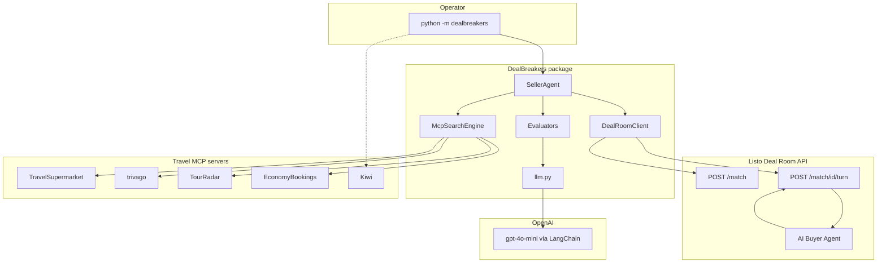
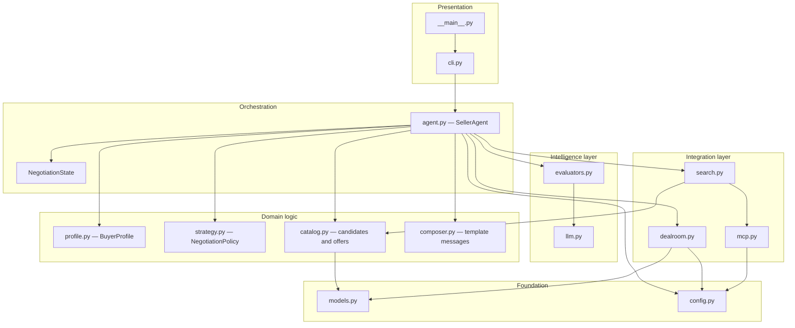
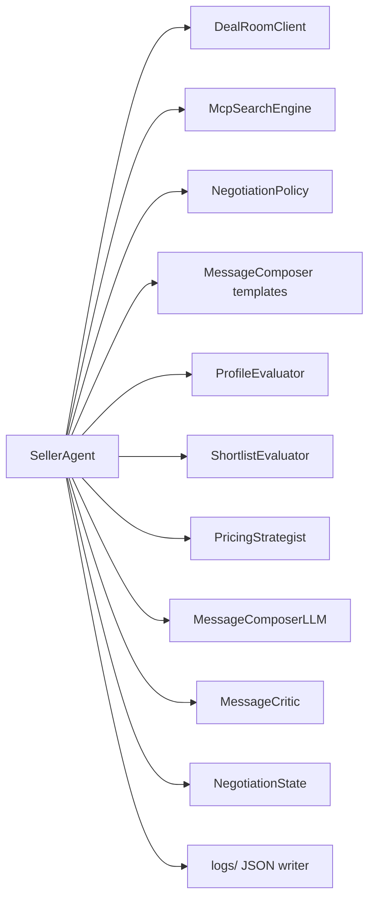
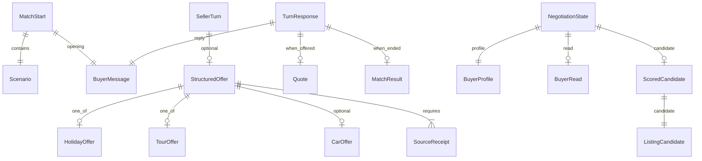
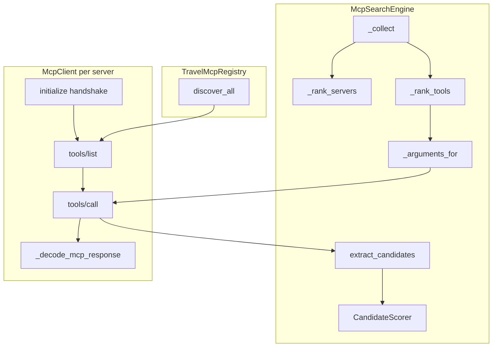
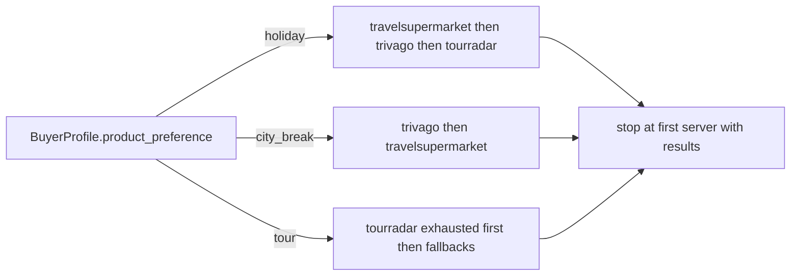
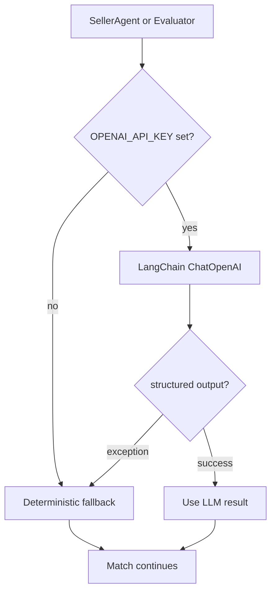
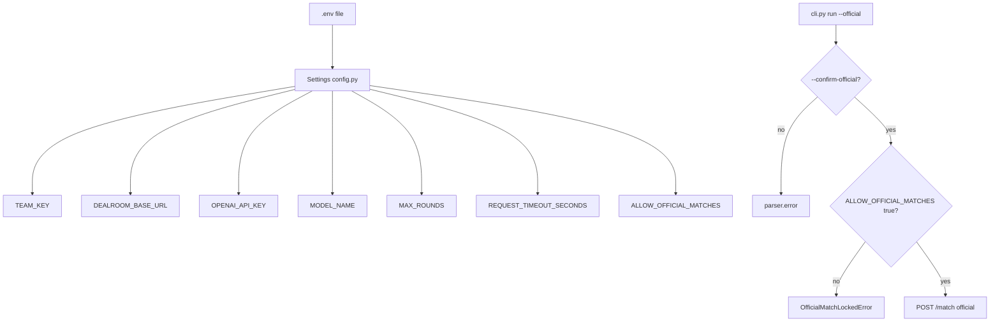
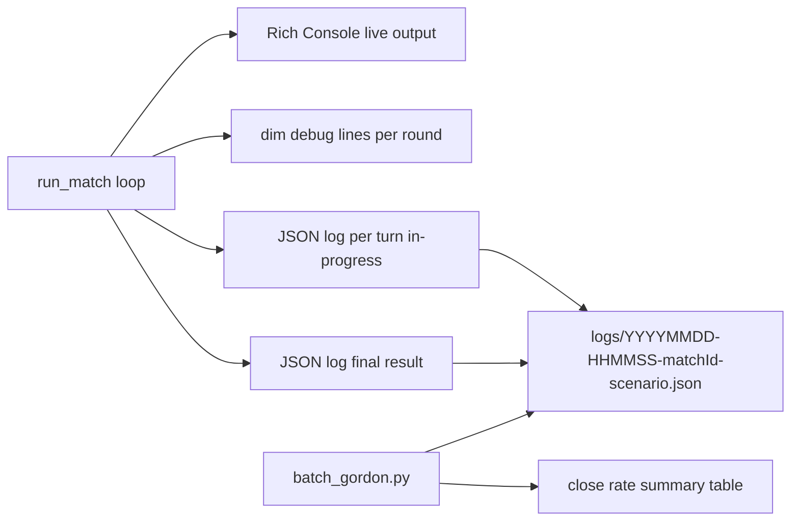

# DealBreakers — System Architecture

Deep-dive architecture reference for the `main` branch implementation. All diagrams reflect code in `dealbreakers/` as of this repository state.

**Related:** [Negotiation flow detail](./NEGOTIATION-FLOW.md) · [README](../README.md)

---

## 1. System context

DealBreakers sits between three external systems: the Listo Deal Room API (buyer negotiation), five travel MCP servers (inventory), and OpenAI (optional judgment calls).



**Legend:** Solid lines are runtime negotiation and search paths. The dotted line to Kiwi is tool discovery only (`discover-tools`); `McpSearchEngine` does not query Kiwi during inventory search.

---

## 2. Package layering



---

## 3. SellerAgent internal wiring

`SellerAgent.__init__` constructs one instance of each collaborator. Nothing is recreated per round except transient LLM calls.



| Collaborator | File | Responsibility |
|--------------|------|----------------|
| `DealRoomClient` | `dealroom.py` | `start_match`, `take_turn`, official lock |
| `McpSearchEngine` | `search.py` | Inventory and car search |
| `NegotiationPolicy` | `strategy.py` | Qualifying question templates |
| `ProfileEvaluator` | `evaluators.py` | Profile extraction and buyer read |
| `ShortlistEvaluator` | `evaluators.py` | Pick best listing from shortlist |
| `PricingStrategist` | `evaluators.py` | Markup decision with `MarkupLadder` |
| `MessageComposerLLM` | `evaluators.py` | Draft seller text |
| `MessageCritic` | `evaluators.py` | Revise draft before send |
| `MessageComposer` | `composer.py` | Template fallbacks |

---

## 4. Data model relationships



### Key types

| Type | Module | Role |
|------|--------|------|
| `BuyerProfile` | `profile.py` | Accumulated buyer requirements |
| `BuyerRead` | `evaluators.py` | Latest-message psychology |
| `ListingCandidate` | `catalog.py` | Normalised MCP listing |
| `ScoredCandidate` | `catalog.py` | Listing plus fit score |
| `StructuredOffer` | `models.py` | API offer payload |
| `SellerTurn` | `models.py` | `{ text, offer? }` sent each turn |
| `Quote` | `models.py` | Server-returned cost, markup, total |

---

## 5. MCP integration architecture



### Server routing by product preference



### Car hire path


---

## 6. LLM integration pattern

Every evaluator follows the same contract: try structured LLM output, fall back to deterministic logic on `None`.



| Evaluator | LLM call | Fallback |
|-----------|----------|----------|
| `ProfileEvaluator.extract` | `ProfileExtraction` schema | `infer_profile()` regex only |
| `ProfileEvaluator.read_buyer` | `BuyerRead` schema | Default read values inside evaluator |
| `ShortlistEvaluator.pick` | `ShortlistVerdict` schema | Highest `CandidateScorer` score |
| `PricingStrategist.decide` | `PricingAdvice` after first quote | `_fallback_markup()` |
| `MessageComposerLLM.compose` | Freeform text | `MessageComposer` template |
| `MessageCritic.review` | `DraftReview` schema | Return draft unchanged |

First quote markup always uses deterministic `anchor_for()` — never LLM.

---

## 7. Offer construction pipeline

```mermaid
flowchart LR
    MCPR["MCP tool result raw JSON"]
    MCPR --> EC["extract_candidates"]
    EC --> LC2["ListingCandidate"]
    LC2 --> CS["CandidateScorer.score"]
    CS --> SC["ScoredCandidate"]
    SC --> PICK["ShortlistEvaluator.pick"]
    PICK --> PS2["PricingStrategist.decide"]
    PS2 --> BUILD["build_offer_from_candidate"]
    BUILD --> SO["StructuredOffer"]
    SO --> VAL["Pydantic validators"]
    VAL --> API["SellerTurn.api_payload"]
    API --> DR4["DealRoomClient.take_turn"]
```



`build_offer_from_candidate()` sets:

- primary product fields (`holiday` or `tour`)
- optional `car` from `find_car()`
- `markupPct` from pricing decision
- `sources[]` with MCP name, URL, and component price

---

## 8. Configuration and safety



---

## 9. Observability architecture



### Log schema (per file)

```json
{
  "matchId": "string",
  "scenario": { "name": "string", "brief": "string" },
  "result": { "closed": true, "endReason": "accept", "rounds": 4 },
  "turns": [
    {
      "round": 1,
      "seller": "text",
      "offer": { "holiday": {}, "markupPct": 12, "sources": [] },
      "buyer": "text",
      "buyer_action": "continue",
      "quote": { "cost": 2552, "markupPct": 12, "total": 2858 }
    }
  ]
}
```

---

## 10. Module file map

| File | Lines of responsibility |
|------|-------------------------|
| `agent.py` | Turn loop, `_evaluate`, `_build_turn`, pivot, logging |
| `evaluators.py` | All LLM evaluators, `MarkupLadder`, `PricingStrategist` |
| `search.py` | MCP search orchestration, car hire |
| `catalog.py` | Candidate extraction, scoring, offer building |
| `mcp.py` | JSON-RPC transport, `TRAVEL_MCPS`, discovery |
| `dealroom.py` | Deal Room HTTP client, official lock |
| `profile.py` | `BuyerProfile`, regex `infer_profile()` |
| `strategy.py` | `NegotiationPolicy`, qualifying questions |
| `composer.py` | Template message fallbacks |
| `models.py` | Pydantic API and offer models |
| `llm.py` | LangChain wrapper with graceful failure |
| `config.py` | `Settings` from environment |
| `cli.py` | `run`, `discover-tools` commands |
