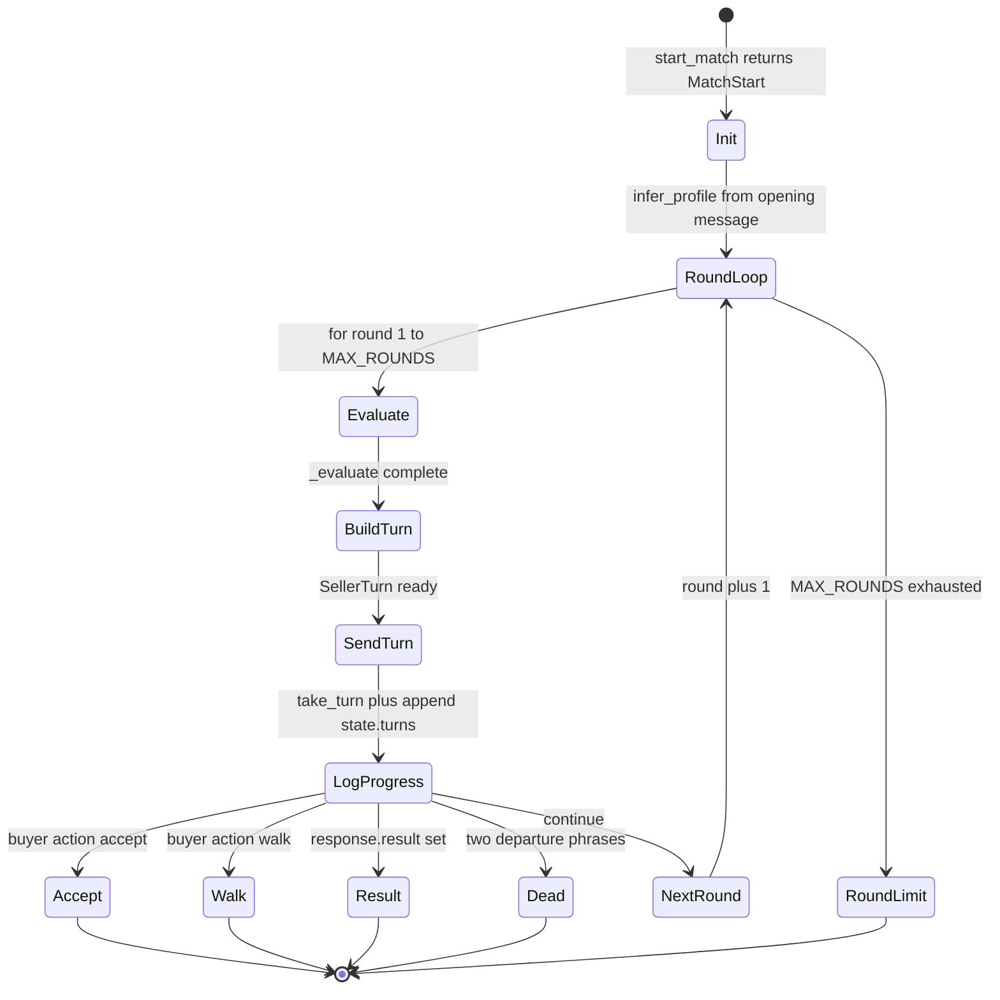
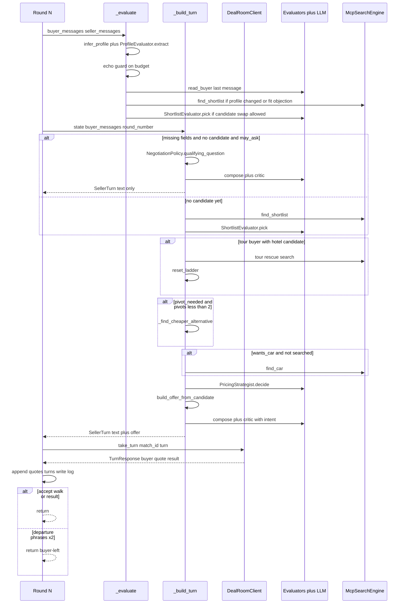
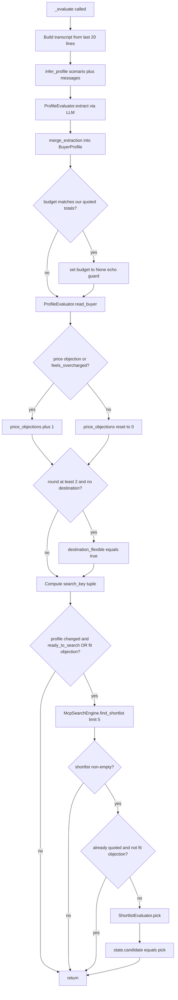
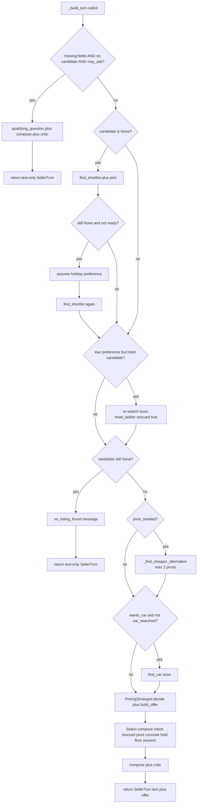
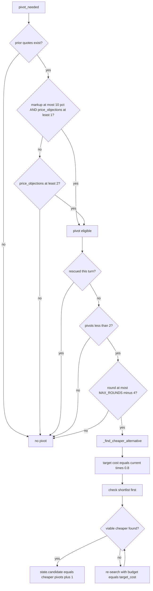
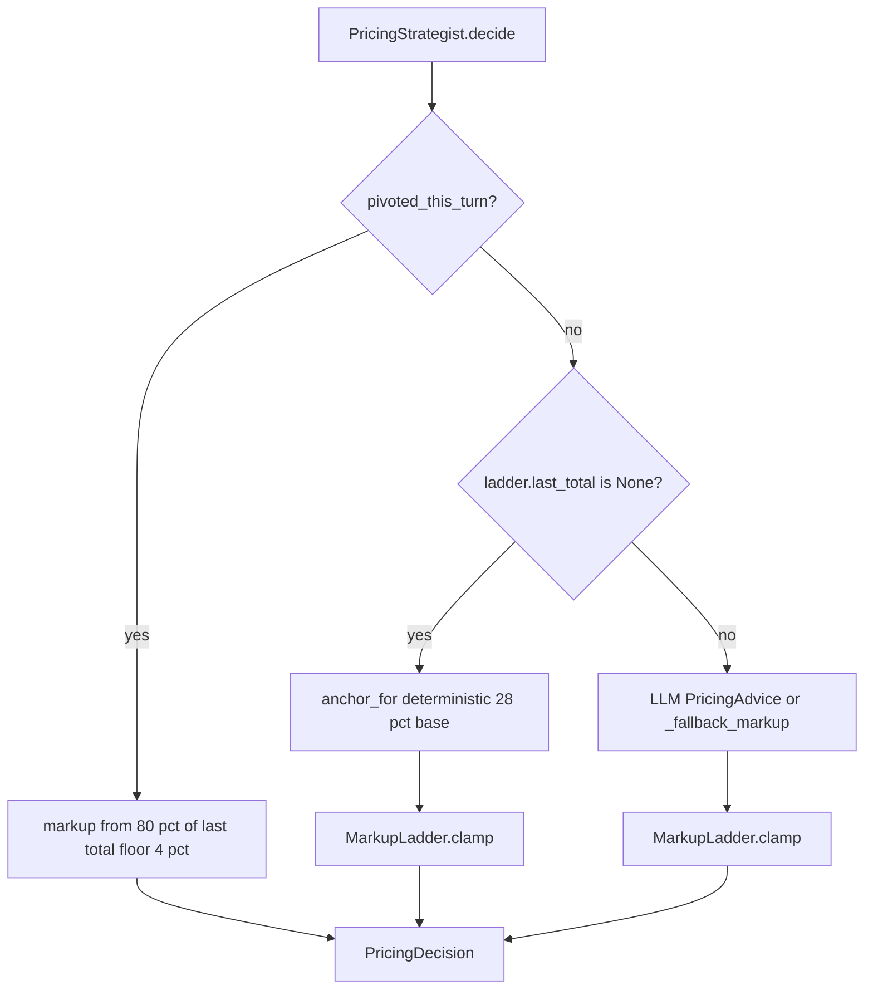
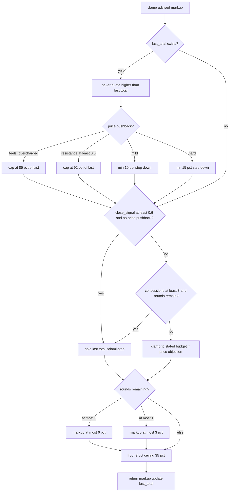
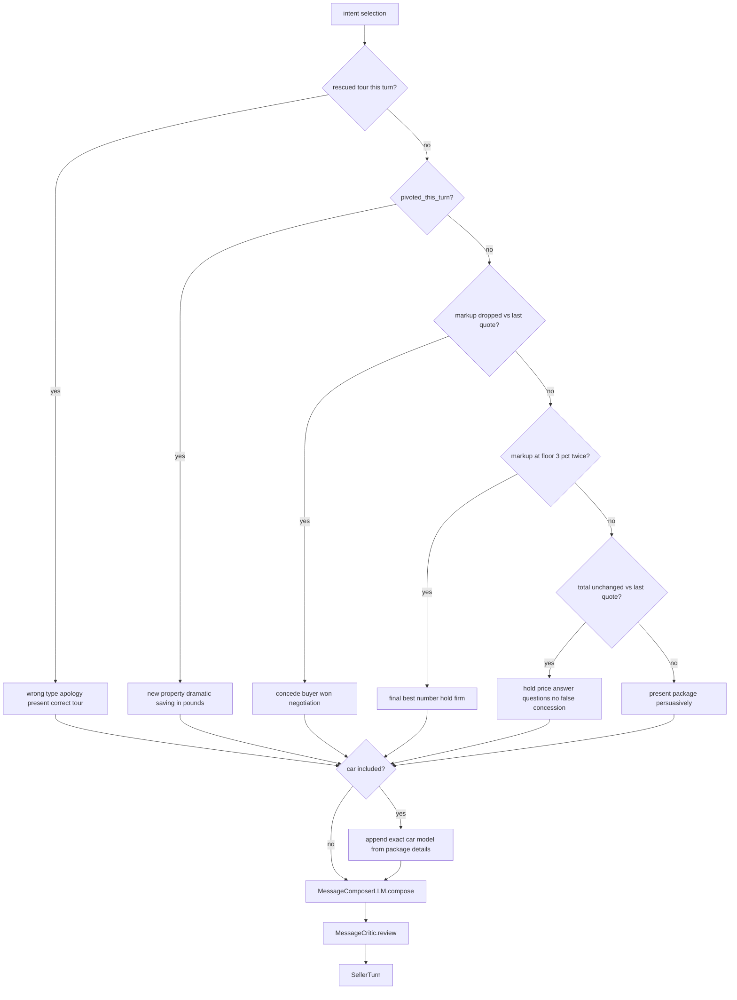
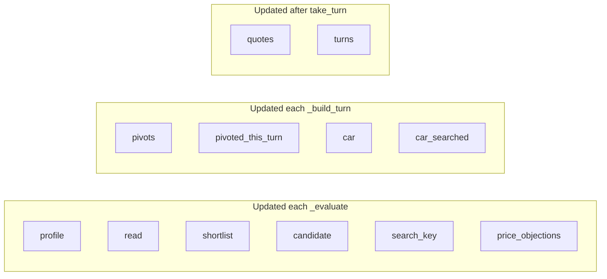
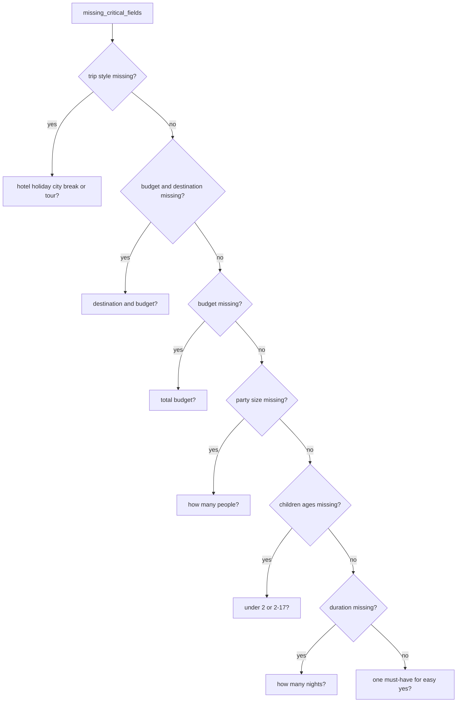

# DealBreakers — Negotiation Flow

Step-by-step flow diagrams for `SellerAgent.run_match()` on the `main` branch. Source of truth: [`dealbreakers/agent.py`](../dealbreakers/agent.py).

**Related:** [System architecture](./ARCHITECTURE.md) · [README](../README.md)

---

## 1. Match lifecycle overview

---

## 2. Full round sequence

---

## 3. `_evaluate` detail

Runs **before** every `_build_turn`. Updates `NegotiationState` in place.

### Sticky candidate rule

Once `state.quotes` is non-empty, background re-search **does not** change `state.candidate` unless `main_objection == fit`. Deliberate product changes happen only in `_build_turn` via tour rescue or price pivot.

---

## 4. `_build_turn` decision tree

### `may_ask` pacing logic

| Condition | Max qualifying rounds |
|-----------|---------------------|
| `impatience >= 0.55` | 1 |
| Patient buyer | 2 |
| Impatient **and** `ready_to_search()` | 0 — search immediately |

---

## 5. Price pivot logic

### Pivot viability checks

- Different URL from current listing
- `price_total <= current * 0.8`
- `score >= 0`
- Luxury buyers (`luxury_weight >= 0.5`): no star-rating downgrade

---

## 6. Pricing decision flow

### `MarkupLadder.clamp` guardrails

### Opening anchor formula (`anchor_for`)

| Signal | Adjustment |
|--------|------------|
| Base | 28% |
| `luxury_weight >= 0.5` | +6% |
| `resistance <= 0.2` and not overcharged | +3% |
| `impatience >= 0.55` | −4% |
| `price_sensitivity >= 0.5` | −8% |
| Stated budget above cost | cap anchor just under budget |
| Final clamp | 12% – 35% |

---

## 7. Message intent selection

After pricing, `_build_turn` picks a compose `intent` string passed to `MessageComposerLLM`:

---

## 8. `NegotiationState` field evolution

| Field | When set | When cleared / reset |
|-------|----------|----------------------|
| `profile` | Every `_evaluate` | Never — accumulates |
| `read` | Every `_evaluate` | Overwritten each round |
| `candidate` | Search, pick, pivot, rescue | Changed only via sticky rules or pivot |
| `quotes` | After each offer response | Append-only |
| `price_objections` | Consecutive price objections | Reset on non-price read |
| `pivots` | Successful pivot | Max 2 per match |
| `car` | `find_car` success | Cleared if `wants_car == False` |
| `car_searched` | First car attempt | Stays true after attempt |

---

## 9. Qualifying question routing

`NegotiationPolicy.qualifying_question()` in `strategy.py`:

---

## 10. End-condition detection

### Server-driven

- `response.buyer.action == accept`
- `response.buyer.action == walk`
- `response.result` is non-null

### Client-driven (`agent.py`)

**Departure detection** — last two buyer messages each contain a phrase from `_DEPARTURE_PHRASES`:

- `already gone`, `walks toward the door`, `out the door`
- `we are done`, `we're done`, `we're finished`
- `nothing more to discuss`, `goodbye`, `adios`, `adiós`
- `walking away`, `i'm walking away`

**Round limit** — loop completes `MAX_ROUNDS` without early return.
